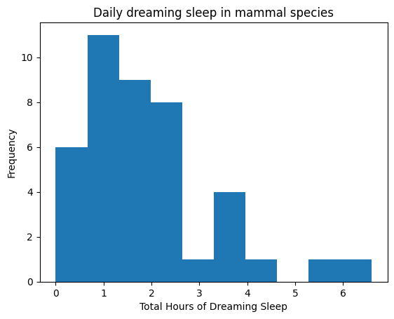
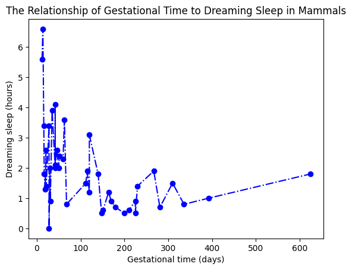

# Sleep Study Analysis

This project analyzes sleep patterns in mammals based on ecological and constitutional variables. It includes data manipulation, visualization, and interpretation.

## Dataset Description
The dataset includes data on sleep duration, ecological factors, and danger levels for a selection of mammal species.  

- **Source**: Allison, T. and Cicchetti, D. (1976), "Sleep in Mammals: Ecological and Constitutional Correlates," *Science*.

- **Details**: [Dataset Repository](https://github.com/bloominstituteoftechnology/data-science-practice-datasets/tree/main/unit_1/Sleep)


## Objectives
1. Explore and manipulate the dataset to uncover patterns.
2. Create visualizations using Matplotlib and Seaborn.
3. Demonstrate the relationship between variables like gestational time and dreaming sleep.
4. Identify proportions of mammals in different danger categories.

## Key Visualizations
### 1. **Histogram of Dreaming Sleep**

- Shows the distribution of dreaming sleep (Parasleep) across mammal species.

### 2. **Gestational Time vs. Dreaming Sleep**

- Highlights the relationship between gestational time and dreaming sleep.


## Files and Structure
- `data/`: Contains the dataset `sleep.csv`.
- `visuals/`: Includes all generated visualizations.
- `notebooks/`: Contains the Jupyter notebook with detailed analysis.
- `README.md`: Project overview and instructions.

## Tasks Overview
1. **Import and Inspect Data**:
   - Load the dataset into a DataFrame and explore the structure.
2. **Visualization Tasks**:
   - Plot histograms and scatter plot to analyze relationships and distributions.
3. **Data Subsetting**:
   - Create subsets for specific danger categories and analyze separately.
4. **Normalization**:
   - Calculate proportions of mammals in each danger category.
5. **Feature Engineering**:
   - Add a new column categorizing mammals by lifespan.

## How to Use
1. Clone this repository:
   ```bash
   git clone https://github.com/JulietOrnellas/sleep-study-analysis.git
